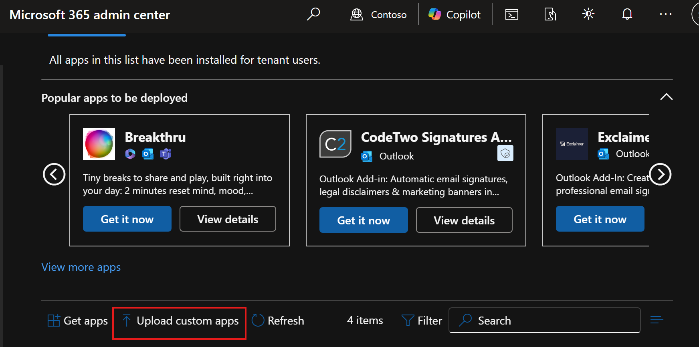

# Upload Plugin Using Manifest File

These instructions create the Word add-in package for organization upload. See the official flow in [Microsoft Learn](https://learn.microsoft.com/en-us/microsoft-365/admin/manage/test-and-deploy-microsoft-365-apps?view=o365-worldwide).

1. Run `bash scripts/create-foundry-agent-and-sync-settings.sh` to configure app settings.
2. Run `npm run package:office-addin` from the workspace root. This command automatically:
	- runs `bash scripts/sync-manifest-from-azd.sh` to update manifest URLs from your current `azd` environment
	- increments the most minor manifest version segment by 1 (for example `1.0.0.1 -> 1.0.0.2`)
	- creates `office365-upload.zip`
3. Confirm the archive `office365-upload.zip` exists at the workspace root. It includes:
	- `manifest.xml`
	- `assets/icon-16.png`
	- `assets/icon-32.png`
	- `assets/icon-80.png`
4. Open [Integrated Apps](https://admin.cloud.microsoft/?#/Settings/IntegratedApps) in the Microsoft 365 admin center.
5. Click the Upload Custom App button.

6. Upload select, Office add-in the option to upload from the url from the static website of the storage account it should be something like `https://[STORAGEACCOUNTNAME].z20.web.core.windows.net/mainfest.xml`.